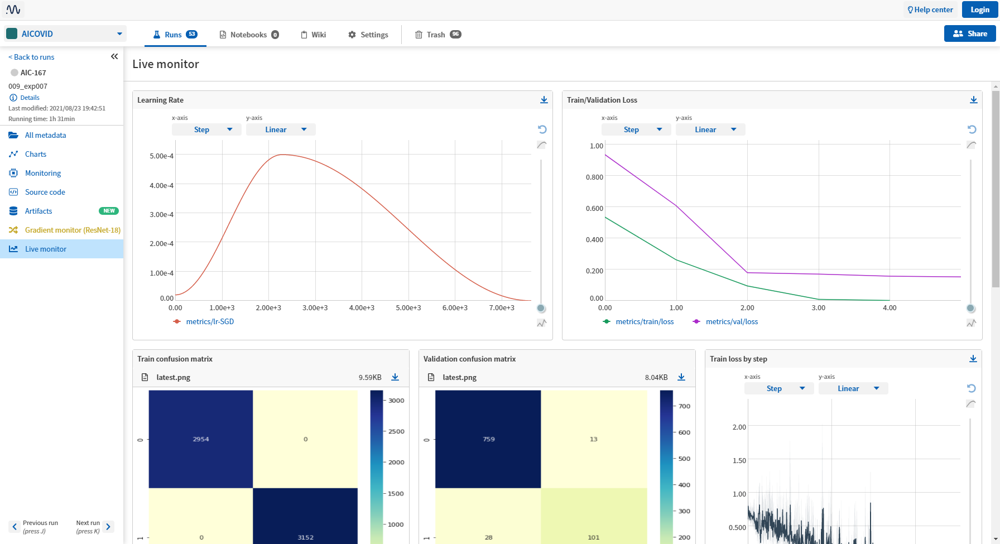

# Tham gia cuộc thi dự đoán tiếng ho AICOVID
(WIP)

Logger chứa metric của quá trình train các model truy cập tại: https://app.neptune.ai/vulong61/AICOVID

---
# Mục tiêu
- Làm quen và biết sử dụng các framework cho Deep Learning, cụ thể là PyTorch, Pytorch Lightning
- Biết được cách làm việc với cách framework để giải quyết 1 bài toán sử dụng Deep Learning.
- Tìm hiểu và áp dụng các kỹ thuật xung quanh bài toán của cuộc thi (kỹ thuật về sử lý âm thanh, các mô hình DL cho âm thanh,...)

# Đánh giá bản thân
## Đã đạt được
- Biết cách sử dụng PyTorch, PyTorch Lightning.
- Biết cách sử dụng Neptune Logger để log các metric trong quá trình train lên internet để tiện theo dõi và giám sát.
- Hình thành được framework từ đọc data, train, chạy predict và lưu lại model.

|  |
| :--: |
| *Dashboard trên Neptune giám sát metric trong quá trình huấn luyện mô hình* |

## Tồn đọng
- Ít thử nghiệm mô hình, mới thử được có 2 mô hình là ResNet và AST.
- Chưa có nhiều kỹ thuật khám phá và xử lý dữ liệu.

---
# Môi trường cài đặt
Do tài nguyên cá nhân có hạn (laptop với GPU max-Q) nên mình chọn sử dụng Google Colab để tận dụng được nguồn tài nguyên tính toán tốt.

---
# Tổ chức github
## Folders
- experiments/ : chứa notebook thực hiện các thí nghiệm. 
- explainations/ : chứa các notebook khám phá dữ liệu. 
- img/ : chứa hình ảnh để trình bày trong readme. 
## Files
(WIP)

---
# Tham khảo
[1]. Laguarta, Jordi, ["COVID-19 Artificial Intelligence Diagnosis Using Only Cough Recordings."](https://dspace.mit.edu/bitstream/handle/1721.1/128954/09208795.pdf?sequence=1&isAllowed=y), <i>IEEE Open Journal of Engineering in Medicine and Biology 1</i> (September 2020): 275 - 281.

[2]. Gong, Y., Chung, Y.-A., and Glass, J., ["AST: Audio Spectrogram Transformer"](https://arxiv.org/abs/2104.01778), <i>arXiv e-prints</i>, 2021.

[3]. He, K., Zhang, X., Ren, S., and Sun, J., ["Deep Residual Learning for Image Recognition"](https://arxiv.org/abs/1512.03385), <i>arXiv e-prints</i>, 2015.

[4]. Kranthi Kumar Lella and Alphonse Pja, ["Automatic diagnosis of COVID-19 disease using deep convolutional neural network with multi-feature channel from respiratory sound data: Cough, voice, and breath"](https://www.sciencedirect.com/science/article/pii/S1110016821003859), <i>Alexandria Engineering Journal</i>, 2021.
